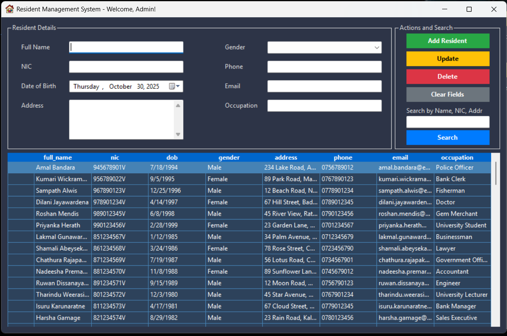

# Resident Management System for Grama Niladhari Division

A standalone desktop application developed as part of the ITE 1943 – ICT Project for the Bachelor of Information Technology degree at the University of Moratuwa.

**Submitted by:** MHR Ahamed (Rihamhanifa)  
**Index Number:** E2410181

---



*Screenshot of the main application dashboard.*

## 📋 Table of Contents
- [About The Project](#-about-the-project)
- [Problem Statement](#-problem-statement)
- [Key Features](#-key-features)
- [Built With](#️-built-with)
- [Getting Started](#-getting-started)
  - [Prerequisites](#prerequisites)
  - [Installation](#installation)
- [Future Enhancements](#-future-enhancements)
- [Screenshots](#️-screenshots)
- [Contact](#-contact)

---

## 📖 About The Project

The **Resident Management System** is a C# Windows Forms desktop application designed to replace the inefficient and error-prone manual, paper-based record-keeping methods used in Grama Niladhari (GN) divisions.

This system provides a secure, centralized, and user-friendly digital solution for GN officers to manage resident information effectively. It automates the entire data management lifecycle, from data entry and validation to quick retrieval and secure storage, thereby improving administrative efficiency and data accuracy.

---

## 🎯 Problem Statement

Traditional record-keeping in GN divisions suffers from several critical issues:
*   **High Risk of Human Error:** Manual data entry leads to inaccurate and inconsistent records.
*   **Data Vulnerability:** Physical documents are susceptible to loss and damage.
*   **Time-Consuming Processes:** Searching for and retrieving specific resident information is a slow and manual task.
*   **Lack of Data Validation:** There is no mechanism to enforce correct data formatting, leading to poor data quality.
*   **Poor Security:** Sensitive personal data is not adequately protected.

This application was built to solve these problems by providing a robust and modern digital alternative.

---

## ✨ Key Features

*   **Secure User Authentication:** Access to the system is protected by a username and password.
*   **Centralized Dashboard:** An all-in-one interface to view and manage all resident records.
*   **Full CRUD Functionality:** Easy-to-use forms for **C**reating, **R**eading, **U**pdating, and **D**eleting resident data.
*   **Powerful Search:** Instantly filter thousands of records by Name, NIC, or Address.
*   **Robust Data Validation:**
    *   Checks for required fields (Name, NIC, Address, Gender).
    *   Validates the format for Sri Lankan NICs (both old 10-character and new 12-digit formats).
    *   Validates the format for phone numbers (optional, but must be 10 digits if provided).
*   **User-Friendly Interface:**
    *   A clean, modern dark-themed design.
    *   Logical Tab Order for easy keyboard navigation.
    *   Helpful Tooltips to guide the user.

---

## 🛠️ Built With

This project was built using the following technologies:

*   **Backend:**
    *   C# (C-Sharp)
    *   .NET Framework 4.8
*   **Frontend:**
    *   Windows Forms (WinForms)
*   **Database:**
    *   MySQL (managed via XAMPP)
*   **IDE:**
    *   Microsoft Visual Studio 2022

---

## 🚀 Getting Started

To get a local copy up and running, follow these simple steps.

### Prerequisites

You will need the following software installed on your machine:

1.  **Windows 10 or 11**
2.  **.NET Framework 4.8** or later (usually included with Windows updates).
3.  **XAMPP:** A local server environment that includes MySQL.
    *   Download from [Apache Friends](https://www.apachefriends.org)

### Installation

1.  **Set up the Database:**
    *   Start the **Apache** and **MySQL** modules from the XAMPP Control Panel.
    *   Go to `http://localhost/phpmyadmin` in your web browser.
    *   Create a new database named `resident_database`.
    *   Select the new database, go to the "SQL" tab, and execute the following SQL script to create the necessary tables:
      ```sql
      -- Users Table
      CREATE TABLE users (
          Username VARCHAR(50) NOT NULL PRIMARY KEY,
          Password VARCHAR(50) NOT NULL
      );

      -- Residents Table
      CREATE TABLE residents (
          id INT AUTO_INCREMENT PRIMARY KEY,
          full_name VARCHAR(100) NOT NULL,
          dob DATE NOT NULL,
          nic VARCHAR(12) UNIQUE NOT NULL,
          address TEXT NOT NULL,
          phone VARCHAR(15),
          email VARCHAR(100),
          occupation VARCHAR(50),
          gender ENUM('Male', 'Female', 'Other') NOT NULL,
          registered_date TIMESTAMP DEFAULT CURRENT_TIMESTAMP
      );

      -- Insert a default user
      INSERT INTO users (Username, Password) VALUES ('admin', '123');
      ```

2.  **Run the Application:**
    *   Clone this repository or download the source code.
    *   Open the solution file (`ResidentManagementSystem.sln`) in Visual Studio.
    *   Press the "Start" button (or F5) to build and run the project.
    *   Log in with Username: `admin` and Password: `123`.

---

## 🔮 Future Enhancements

This project provides a solid foundation, but there are many opportunities for future improvements to make it even more powerful and versatile.

*   **Cloud Database Integration:**
    *   Migrate the database from a local XAMPP server to a managed cloud database service (like PlanetScale, Amazon RDS, or Azure SQL). This would enable multiple users from different locations to access and manage the same centralized data, turning it into a collaborative tool.

*   **Web-Based Version:**
    *   Develop a full web application version of the system to allow access from any device with an internet browser, removing the dependency on a Windows desktop.

*   **Enhanced Security:**
    *   Implement robust password hashing (e.g., using bcrypt or Argon2) to securely store user credentials instead of plain text.
    *   Introduce multi-factor authentication (MFA) for an extra layer of security.

*   **Advanced Reporting:**
    *   Create a dedicated module to generate, print, and export various reports, such as demographic summaries or lists of residents in a specific area.

---

## 🖼️ Screenshots

<p align="center">
  
  &nbsp;&nbsp;&nbsp;&nbsp;
  
</p>
<p align="center">
  <em>Login Screen and an example of Input Validation.</em>
</p>

<p align="center">
  
</p>
<p align="center">
  <em>Powerful search filters the data grid instantly.</em>
</p>

---

## 📬 Contact
For questions, suggestions, or issues, feel free to reach out:  

- **GitHub**: [Rihamhanifa](https://github.com/Rihamhanifa)
- **LinkedIn**: [Riham Hanifa](https://www.linkedin.com/in/riham-hanifa/)  
- **Email**: *rihamarh0@gmail.com*

Project Link: [https://github.com/Rihamhanifa/ResidentManagementSystem](https://github.com/Rihamhanifa/ResidentManagementSystem)
